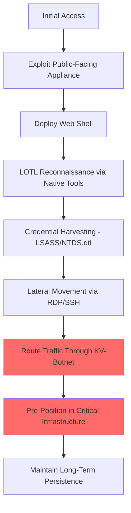

# Volt Typhoon (Vanguard Panda) Simulation

## Overview
**Volt Typhoon** (also known as Vanguard Panda, BRONZE SILHOUETTE, Insidious Taurus, Storm-0391) is a Chinese state-sponsored APT group that targets critical infrastructure in the United States and its territories, including Guam. Active since at least 2021, Volt Typhoon is notable for its heavy reliance on living-off-the-land (LOTL) techniques, avoiding custom malware in favor of native OS tools. FBI Director Christopher Wray described them as "the defining threat of our generation" in January 2024.

## Attribution
- **Country**: China
- **Sponsor**: People's Republic of China (PRC) - Ministry of State Security (MSS)
- **Active Since**: 2021
- **Aliases**: Vanguard Panda, BRONZE SILHOUETTE, Insidious Taurus, Dev-0391, UNC3236, Voltzite, Storm-0391

## Attack Overview
This simulation demonstrates Volt Typhoon's infrastructure pre-positioning techniques:
1. **Living-off-the-Land**: Exclusive use of native OS tools (ntdsutil, netsh, PowerShell, wevtutil)
2. **KV-Botnet**: Compromised SOHO routers used as proxy infrastructure
3. **Credential Harvesting**: LSASS memory dumps and NTDS.dit theft
4. **Appliance Exploitation**: Targeting Fortinet, Ivanti, Versa Director zero-days

## MITRE ATT&CK Mapping

### Initial Access
- **T1190** - Exploit Public-Facing Application (Fortinet, Ivanti, Versa Director CVE-2024-39717)
- **T1078** - Valid Accounts (stolen credentials from prior breaches)

### Execution
- **T1059.001** - PowerShell
- **T1059.003** - Windows Command Shell
- **T1106** - Native API

### Persistence
- **T1078** - Valid Accounts
- **T1505.003** - Web Shell (Versa Director web shells)

### Privilege Escalation
- **T1003.001** - LSASS Memory (comsvcs.dll MiniDump)
- **T1003.003** - NTDS (ntdsutil snapshot)

### Defense Evasion
- **T1218** - System Binary Proxy Execution (LOLBins)
- **T1027** - Obfuscated Files (Base64-encoded PowerShell)
- **T1070.001** - Clear Windows Event Logs (wevtutil)

### Credential Access
- **T1003.001** - LSASS Memory
- **T1003.003** - NTDS.dit Extraction
- **T1555.003** - Credentials from Web Browsers

### Discovery
- **T1082** - System Information Discovery (systeminfo)
- **T1016** - System Network Configuration Discovery (netsh, ipconfig)
- **T1049** - System Network Connections Discovery (netstat)

### Lateral Movement
- **T1021.001** - Remote Desktop Protocol
- **T1021.004** - SSH

### Command & Control
- **T1090.002** - External Proxy (KV-Botnet via compromised SOHO routers)
- **T1071.001** - Web Protocols (HTTPS)
- **T1572** - Protocol Tunneling

### Exfiltration
- **T1560.001** - Archive via Utility (password-protected archives)
- **T1041** - Exfiltration Over C2 Channel

## Tools & Malware Simulated

### 1. LOTL Reconnaissance Module (Python)
- **File**: `tools/lotl_recon.py`
- **Description**: Native OS tool usage for reconnaissance via `subprocess`
- **Capabilities**: Real systeminfo, netsh, ipconfig, netstat, wevtutil calls, WMI queries, DNS cache dumping, security product enumeration

### 2. LOTL Discovery Script (PowerShell)
- **File**: `tools/lotl_discovery.ps1`
- **Description**: PowerShell living-off-the-land discovery using native cmdlets
- **Capabilities**: Get-WmiObject, Get-NetNeighbor, Get-ScheduledTask, Get-WinEvent, AD enumeration via nltest, sensitive file search

### 3. Credential Harvester (Python)
- **File**: `tools/credential_harvester.py`
- **Description**: LSASS memory dumping and AD database extraction via Windows API
- **Capabilities**: ctypes SeDebugPrivilege elevation, CreateToolhelp32Snapshot, comsvcs.dll MiniDump, NTDS.dit extraction, SAM hive management, WiFi profile extraction

### 4. KV-Botnet Proxy (Python)
- **File**: `c2/kv_botnet_proxy.py`
- **Description**: Full RFC 1928 SOCKS5 proxy server with KV-Botnet authentication
- **Capabilities**: Bidirectional data relay, IPv4/IPv6/domain support, upstream proxy chaining, connection statistics

### 5. Webshell Dropper (Python)
- **File**: `payloads/webshell_dropper.py`
- **Description**: Network appliance exploitation and webshell deployment
- **Capabilities**: Versa Director CVE-2024-39717, Ivanti CVE-2023-46805 chain, FortiOS CVE-2022-42475 heap overflow with ROP chain

### 6. Versa Director Exploit (C++)
- **File**: `payloads/versa_exploit.cpp`
- **Description**: C++ exploit payload with real WinSock/WinInet networking
- **Capabilities**: HTTP request crafting, multipart form data, JSP webshell generation, DNS resolution via getaddrinfo

### 7. VPN Login Phishing Page (HTML/JS)
- **File**: `artifacts/fake_vpn_login.html`
- **Description**: Credential phishing page mimicking FortiGate SSL VPN portal
- **Capabilities**: Image beacon, sendBeacon, DNS subdomain exfiltration, JavaScript keylogger, victim fingerprinting

## Indicators of Compromise (IOCs)

### File Hashes (Simulated)
```
lotl_recon.py:             SHA256: [SIMULATION - NOT REAL MALWARE]
credential_harvester.py:   SHA256: [SIMULATION - NOT REAL MALWARE]
kv_botnet_proxy.py:        SHA256: [SIMULATION - NOT REAL MALWARE]
webshell_dropper.py:       SHA256: [SIMULATION - NOT REAL MALWARE]
```

### Network Indicators
- Traffic from compromised SOHO routers (Cisco RV320, NetGear ProSAFE)
- Anomalous ntdsutil.exe and comsvcs.dll execution
- Encoded PowerShell commands in event logs
- Versa Director API exploitation attempts (/versa/app/*)

### Behavioral Indicators
- No custom malware deployed post-compromise
- Exclusive use of built-in Windows tools
- Long dwell times (months to years)
- Targeting of OT/SCADA adjacent networks

## Attack Simulation Flow



## References & Threat Intelligence

1. **MITRE ATT&CK** - Volt Typhoon Profile
   - https://attack.mitre.org/groups/G1017/

2. **CISA** - PRC State-Sponsored Actors Compromise Critical Infrastructure
   - https://www.cisa.gov/news-events/cybersecurity-advisories/aa24-038a

3. **Microsoft** - Volt Typhoon Targets US Critical Infrastructure
   - https://www.microsoft.com/en-us/security/blog/2023/05/24/volt-typhoon-targets-us-critical-infrastructure/

4. **CrowdStrike** - Vanguard Panda Analysis
   - https://www.crowdstrike.com/adversaries/vanguard-panda/

5. **Black Lotus Labs** - KV-Botnet Analysis
   - https://blog.lumen.com/routers-roasting-on-an-open-fire/

## Disclaimer
FOR EDUCATIONAL AND RESEARCH PURPOSES ONLY

This simulation contains educational tools designed to demonstrate APT techniques. All tools are non-functional proof-of-concepts and should only be used in authorized security research environments. Unauthorized use may violate applicable laws.
