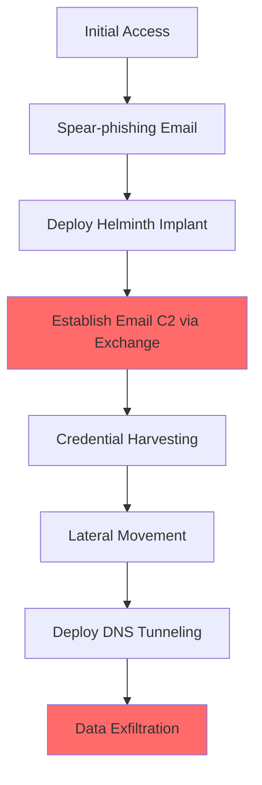

# Helix Kitten (APT34/OilRig) Simulation

## Overview
**Helix Kitten** (also known as APT34, OilRig, Hazel Sandstorm) is an Iranian state-sponsored APT group conducting cyber espionage operations. Active since at least 2014, they target government, financial, telecommunications, and energy sectors primarily in the Middle East.

## Attribution
- **Country**: 🇮🇷 Iran
- **Sponsor**: Ministry of Intelligence and Security (MOIS)
- **Active Since**: 2014
- **Aliases**: APT34, OilRig, Hazel Sandstorm, Earth Simnavaz, Cobalt Gypsy

## Attack Overview
This simulation demonstrates Helix Kitten's espionage techniques:
1. **DNS Tunneling**: Covert data exfiltration via DNS
2. **Email-based C2**: Using Exchange servers for command-and-control
3. **Steganography**: Hiding commands in bitmap images
4. **Credential Harvesting**: LaZagne and custom tools

## MITRE ATT&CK Mapping

### Initial Access
- **T1566.001** - Spear-phishing Attachment
- **T1566.002** - Spear-phishing Link (LinkedIn, fake VPN pages)
- **T1190** - Exploit Public-Facing Application

### Execution
- **T1059.001** - PowerShell
- **T1059.005** - Visual Basic
- **T1047** - Windows Management Instrumentation

### Persistence
- **T1505.003** - Web Shell
- **T1053.005** - Scheduled Task

### Defense Evasion
- **T1027** - Obfuscated Files
- **T1562.004** - Disable System Firewall
- **T1001.002** - Steganography

### Credential Access
- **T1003.001** - LSASS Memory
- **T1555.003** - Credentials from Browsers

### Discovery
- **T1018** - Remote System Discovery
- **T1069** - Permission Groups Discovery

### Command & Control
- **T1071.004** - DNS Tunneling
- **T1114.002** - Email-based C2 (Exchange)
- **T1001.002** - Steganography

### Exfiltration
- **T1048.003** - DNS Exfiltration
- **T1041** - C2 Channel

## Tools & Malware Simulated

### 1. DNS Tunneling C2 (Python)
- **File**: `tools/dns_tunneling.py`
- **Description**: Full DNS-based C2 server with RFC 1035 packet construction
- **Capabilities**: DNS query/response building and parsing, data encoding in subdomain labels, bidirectional TXT/A record communication, session tracking, exfiltration buffering

### 2. Steganography Exfiltration (Python)
- **File**: `tools/steganography.py`
- **Description**: Image-based covert data channel using LSB and PNG metadata
- **Capabilities**: BMP file construction, configurable LSB embedding/extraction, zlib compression, PNG tEXt chunk data hiding, capacity analysis

### 3. Credential Harvester (PowerShell)
- **File**: `tools/credential_harvester.ps1`
- **Description**: AD reconnaissance and credential collection via native cmdlets
- **Capabilities**: Credential Manager enumeration, browser DPAPI key discovery, LDAP SPN queries, Kerberoasting via KerberosRequestorSecurityToken, WiFi key extraction, domain trust enumeration

### 4. Exchange Email C2 (Python)
- **File**: `c2/exchange_c2.py`
- **Description**: Exchange Web Services dead drop C2 channel
- **Capabilities**: NTLM Type 1/3 authentication packets, EWS SOAP envelope building (FindItem/CreateItem/DeleteItem), NTLMv2 hash computation, drafts folder dead drop pattern

### 5. DNS Exfiltration Tool (C++)
- **File**: `payloads/dns_exfil.cpp`
- **Description**: Data exfiltration via raw DNS queries over WinSock
- **Capabilities**: RFC 1035 packet construction, DNS wire format encoding, hex-encoded subdomain chunking, jittered timing, TXT query support, system info collection

### 6. OWA Phishing Page (HTML/JS)
- **File**: `artifacts/owa_phishing.html`
- **Description**: Credential phishing page mimicking Microsoft Outlook Web App
- **Capabilities**: Dual exfiltration (image beacon + sendBeacon), password field keylogger, multi-attempt harvesting, victim fingerprinting, redirect to real OWA


## Indicators of Compromise (IOCs)

### File Hashes (Simulated)
```
helminth_implant.py:       SHA256: [SIMULATION - NOT REAL MALWARE]
dns_exfiltrator.py:        SHA256: [SIMULATION - NOT REAL MALWARE]
email_c2_exchange.py:      SHA256: [SIMULATION - NOT REAL MALWARE]
oilrig_dropper.py:         SHA256: [SIMULATION - NOT REAL MALWARE]
```

### Network Indicators
- DNS queries with unusual subdomains
- Exchange Web Services (EWS) traffic
- Suspicious email attachments (.chm, .hta files)

## Attack Simulation Flow



## References & Threat Intelligence

1. **MITRE ATT&CK** - APT34 Profile
   - https://attack.mitre.org/groups/G0049/

2. **CrowdStrike** - Helix Kitten Analysis
   - https://www.crowdstrike.com/adversaries/helix-kitten/

3. **FireEye** - APT34 Attacks Middle East
   - https://www.mandiant.com/resources/apt34-new-targeted-attack-middle-east

4. **Cisco Talos** - DNSpionage Campaign
   - https://blog.talosintelligence.com/2018/11/dnspionage-campaign-targets-middle-east.html

5. **MITRE** - OilRig Malware Analysis
   - https://www.mitre.org/publications/technical-papers/oilrig-targets

## Disclaimer
⚠️ **FOR EDUCATIONAL AND RESEARCH PURPOSES ONLY**

This simulation contains educational tools designed to demonstrate APT techniques. All tools are non-functional proof-of-concepts and should only be used in authorized security research environments. Unauthorized use may violate applicable laws.
