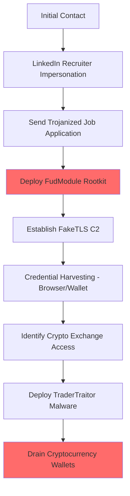

# Lazarus Group (Labyrinth Chollima) Simulation

## Overview
**Lazarus Group** (also known as Labyrinth Chollima, HIDDEN COBRA, APT38, ZINC, TraderTraitor, Diamond Sleet) is a North Korean state-sponsored APT group responsible for some of the most significant cyber heists in history. In 2024 alone, Lazarus stole over $1.34 billion in cryptocurrency across 47 incidents, accounting for 61% of all stolen crypto assets that year. Their operations fund North Korea's ballistic missile and nuclear weapons programs.

## Attribution
- **Country**: North Korea
- **Sponsor**: Reconnaissance General Bureau (RGB)
- **Active Since**: 2009
- **Aliases**: Labyrinth Chollima, HIDDEN COBRA, APT38, ZINC, Diamond Sleet, TraderTraitor, BlueNoroff

## Attack Overview
This simulation demonstrates Lazarus Group's cryptocurrency theft operations:
1. **Operation Dream Job**: Social engineering via fake recruiter profiles on LinkedIn
2. **FudModule Rootkit**: Kernel-level rootkit exploiting Windows zero-days
3. **FakeTLS C2**: Custom C2 protocol mimicking legitimate TLS handshakes
4. **TraderTraitor**: Targeting DeFi platforms and cryptocurrency exchanges

## MITRE ATT&CK Mapping

### Initial Access
- **T1566.001** - Spear-phishing Attachment (trojanized job applications)
- **T1566.003** - Spear-phishing via Service (LinkedIn, Telegram recruiters)
- **T1195.002** - Supply Chain Compromise (malicious npm packages)

### Execution
- **T1059.001** - PowerShell
- **T1059.003** - Windows Command Shell
- **T1204.002** - Malicious File (trojanized VNC, PDF readers)

### Persistence
- **T1547.001** - Registry Run Keys / Startup Folder
- **T1543.003** - Windows Service

### Privilege Escalation
- **T1068** - Exploitation for Privilege Escalation (CVE-2024-38193, CVE-2024-21338)
- **T1134** - Access Token Manipulation

### Defense Evasion
- **T1562.001** - Disable or Modify Tools (FudModule rootkit)
- **T1027** - Obfuscated Files or Information
- **T1036** - Masquerading (mimicking legitimate software)
- **T1070** - Indicator Removal (timestomp, sdelete)

### Credential Access
- **T1555.003** - Credentials from Web Browsers (Chrome stealer)
- **T1539** - Steal Web Session Cookie

### Discovery
- **T1083** - File and Directory Discovery
- **T1087** - Account Discovery
- **T1046** - Network Service Discovery

### Command & Control
- **T1071.001** - Web Protocols (FakeTLS over HTTPS)
- **T1573** - Encrypted Channel (custom AES/XOR encryption)
- **T1090** - Proxy (MidProxy, Proxy Mini)

### Exfiltration
- **T1041** - Exfiltration Over C2 Channel
- **T1560** - Archive Collected Data (RAR/ZIP before exfil)

## Tools & Malware Simulated

### 1. Dream Job Lure (Python)
- **File**: `tools/dream_job_lure.py`
- **Description**: Operation Dream Job social engineering campaign
- **Capabilities**: XOR-encrypted payloads, LNK file structure generation, ZIP archive creation, npm typosquatting with preinstall hooks, fake recruiter profile generation

### 2. FudModule Rootkit (Python)
- **File**: `tools/fudmodule_rootkit.py`
- **Description**: Kernel-level rootkit simulating EDR bypass via Windows API
- **Capabilities**: ctypes NtQuerySystemInformation, psapi driver enumeration, EDR driver detection, token privilege querying, CVE-2024-38193 exploitation walkthrough

### 3. Chrome Credential Stealer (C++)
- **File**: `tools/chrome_stealer.cpp`
- **Description**: Chromium browser credential extraction via WinAPI
- **Capabilities**: Browser profile enumeration, DPAPI master key decryption via CryptUnprotectData, SQLite Login Data analysis, cookie database extraction

### 4. FakeTLS C2 (Python)
- **File**: `c2/faketls_c2.py`
- **Description**: Custom C2 protocol mimicking TLS 1.2 handshakes
- **Capabilities**: ClientHello/ServerHello packet construction with struct packing, cipher suite arrays, SNI extensions, session key derivation, XOR-encrypted Application Data records

### 5. Crypto Drainer / TraderTraitor (Python)
- **File**: `payloads/crypto_drainer.py`
- **Description**: Cryptocurrency exchange targeting and wallet theft
- **Capabilities**: Base58/Base58Check encoding, RLP transaction encoding, browser extension wallet enumeration, Etherscan API patterns, drain transaction construction with gas calculations

### 6. Supply Chain Attack (Node.js)
- **File**: `payloads/supply_chain.js`
- **Description**: Malicious npm package simulating supply chain compromise
- **Capabilities**: CI/CD sandbox detection, host fingerprinting, cryptocurrency wallet file discovery, DNS and HTTPS exfiltration, cross-platform persistence

### 7. Dream Job Offer Page (HTML/JS)
- **File**: `artifacts/dream_job_offer.html`
- **Description**: LinkedIn-themed phishing page with HTML smuggling
- **Capabilities**: Victim fingerprinting, sendBeacon exfiltration, base64 payload construction, Blob URL download trigger

## Indicators of Compromise (IOCs)

### File Hashes (Simulated)
```
dream_job_lure.py:         SHA256: [SIMULATION - NOT REAL MALWARE]
fudmodule_rootkit.py:      SHA256: [SIMULATION - NOT REAL MALWARE]
faketls_c2.py:             SHA256: [SIMULATION - NOT REAL MALWARE]
crypto_drainer.py:         SHA256: [SIMULATION - NOT REAL MALWARE]
```

### Network Indicators
- FakeTLS handshakes with non-standard cipher suites
- Connections to cryptocurrency exchange APIs
- npm package registry downloads of malicious packages
- Beaconing over HTTPS with custom XOR-encrypted payloads

### Behavioral Indicators
- LinkedIn messages from recruiters at non-existent companies
- Skills assessment executables (.exe, .msi) from job interviews
- Kernel driver loads exploiting AFD.sys (CVE-2024-38193)
- Chrome browser data exfiltration

## Attack Simulation Flow



## References & Threat Intelligence

1. **MITRE ATT&CK** - Lazarus Group Profile
   - https://attack.mitre.org/groups/G0032/

2. **CrowdStrike** - Labyrinth Chollima Analysis
   - https://www.crowdstrike.com/adversaries/labyrinth-chollima/

3. **FBI** - TraderTraitor Advisory
   - https://www.cisa.gov/news-events/cybersecurity-advisories/aa22-108a

4. **Kaspersky** - Operation Dream Job
   - https://securelist.com/lazarus-operation-dreamjob/114858/

5. **Avast** - FudModule Rootkit Analysis
   - https://decoded.avast.io/janvojtesek/lazarus-and-the-fudmodule-rootkit/

## Disclaimer
FOR EDUCATIONAL AND RESEARCH PURPOSES ONLY

This simulation contains educational tools designed to demonstrate APT techniques. All tools are non-functional proof-of-concepts and should only be used in authorized security research environments. Unauthorized use may violate applicable laws.
