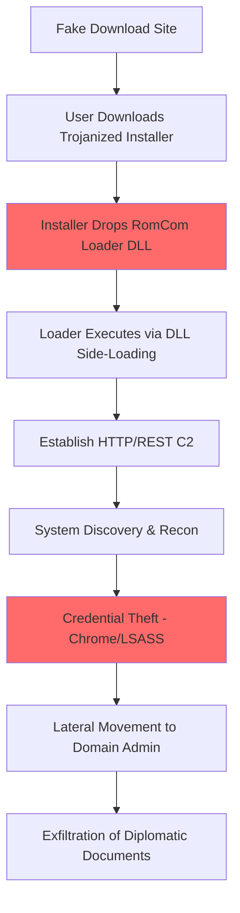

# RomCom (Storm-0978 / Tropical Scorpius) Simulation

## Overview
**RomCom** (also known as Storm-0978, Tropical Scorpius, UNC2596, Diamond Sleet) is a Russian-based threat actor known for conducting both financially motivated cybercrime and targeted state-sponsored espionage. The group rose to prominence in 2023 for its sophisticated targeting of the NATO Summit in Vilnius and government entities across Ukraine and Europe. They are famous for their technique of creating trojanized versions of legitimate software to gain initial access.

## Attribution
- **Country**: Russia (Linked/Affiliated)
- **Active Since**: 2022
- **Aliases**: Storm-0978, Tropical Scorpius, UNC2596, Void Rabisu
- **Targets**: Ukraine, NATO member states, government, military, and telecommunications

## Attack Overview
This simulation focuses on RomCom's espionage TTPs used against high-value targets:
1. **Trojanized Software Lures**: Distribution of malicious "Advanced IP Scanner" or "Veeam" installers.
2. **RomCom RAT**: A modular C++ backdoor capable of extensive system reconnaissance.
3. **HTTP/REST C2**: Covert communications via standard web protocols to blend with traffic.
4. **Credential Harvesting**: Extraction of domain and local credentials for lateral movement.

## MITRE ATT&CK Mapping

### Initial Access
- **T1566.002** - Spear-phishing Link (links to fake software sites)
- **T1204.002** - Malicious File (trojanized legitimate installers)
- **T1189** - Drive-by Compromise (fake software download portals)

### Execution
- **T1059.003** - Windows Command Shell
- **T1106** - Native API (loading DLLs via LoadLibrary)
- **T1204.002** - Malicious File

### Persistence
- **T1547.001** - Registry Run Keys / Startup Folder
- **T1574.002** - DLL Side-Loading

### Privilege Escalation
- **T1068** - Exploitation for Privilege Escalation (CVE-2023-36884)
- **T1055** - Process Injection

### Defense Evasion
- **T1027** - Obfuscated Files or Information
- **T1036.005** - Masquerading: Match Legitimate Name or Location
- **T1574.002** - DLL Side-Loading

### Credential Access
- **T1003.001** - LSASS Memory
- **T1555.003** - Credentials from Web Browsers

### Discovery
- **T1083** - File and Directory Discovery
- **T1016** - System Network Configuration Discovery
- **T1057** - Process Discovery

### Command & Control
- **T1071.001** - Web Protocols (HTTP/REST)
- **T1573** - Encrypted Channel (custom XOR/AES)

### Exfiltration
- **T1041** - Exfiltration Over C2 Channel

## Tools & Malware Simulated

### 1. Trojanized Application Generator (Python)
- **File**: `tools/trojanized_lure.py`
- **Description**: DLL side-loading attack package generation for 4 real RomCom targets
- **Capabilities**: PE header construction, DLL export table matching, application manifest generation, typosquat domain generation (Advanced IP Scanner, PDF-XChange, KeePass, SolarWinds NPM)

### 2. HTTP/REST C2 Server (Python)
- **File**: `c2/http_rest_c2.py`
- **Description**: Full HTTP REST C2 server with AES-256 encrypted JSON payloads
- **Capabilities**: Implant registration, task polling with beacon tracking, file exfiltration endpoints, fake nginx headers, session management

### 3. RomCom RAT Core (Python)
- **File**: `payloads/romcom_rat_sim.py`
- **Description**: Modular RAT with real system interaction via ctypes and subprocess
- **Capabilities**: GDI-based screen capture via BitBlt/GetDIBits, browser credential database enumeration, DPAPI key extraction, sensitive file discovery, AES-256-CBC encrypted C2 protocol

### 4. DLL Side-Loader Payload (C++)
- **File**: `payloads/dll_sideloader.cpp`
- **Description**: Real DLL side-loading implementation (version.dll proxy)
- **Capabilities**: Proxies all version.dll exports to real system DLL, WinInet HTTPS beaconing, system info collection via WinAPI, jittered beacon intervals, sandbox evasion delay

### 5. Trojanized Download Site (HTML/JS)
- **File**: `artifacts/trojanized_download.html`
- **Description**: Fake software download page mimicking Advanced IP Scanner website
- **Capabilities**: HTML smuggling payload delivery, bot/automation detection, victim fingerprinting, sendBeacon exfiltration, download progress UX

## Indicators of Compromise (IOCs)

### File Hashes (Simulated)
```
trojanized_lure.py:       SHA256: [SIMULATION - NOT REAL MALWARE]
http_rest_c2.py:          SHA256: [SIMULATION - NOT REAL MALWARE]
romcom_rat_sim.py:        SHA256: [SIMULATION - NOT REAL MALWARE]
```

### Network Indicators
- Connections to domains mimicking legitimate tech sites (e.g., `advanced-ip-scanner-download.com`)
- HTTP POST requests to `/api/v1/update` with encrypted JSON payloads
- Specific User-Agent strings (e.g., `Mozilla/5.0 (Windows NT 10.0; Win64; x64)`)

### Behavioral Indicators
- Dropping `prerequisites.exe` or `mscoree.dll` in temp directories
- RegSRV32 execution of non-standard DLLs
- Unusual network activity from `AdvancedIPScanner.exe`

## Attack Simulation Flow



## References & Threat Intelligence

1. **Microsoft Threat Intelligence** - Storm-0978 Analysis
   - https://www.microsoft.com/en-us/security/blog/2023/07/11/storm-0978-attacks-reveal-financial-and-espionage-motives/

2. **Palo Alto Unit 42** - RomCom Targeting NATO Summit
   - https://unit42.paloaltonetworks.com/romcom-targets-ukraine-nato-summit-vilnius/

3. **Trend Micro** - RomCom’s New Artifice
   - https://www.trendmicro.com/en_us/research/23/e/romcom-backdoor-new-artifice-new-victims.html

4. **MITRE ATT&CK** - RomCom Entry
   - https://attack.mitre.org/software/S1079/

## Disclaimer
FOR EDUCATIONAL AND RESEARCH PURPOSES ONLY

This simulation contains educational tools designed to demonstrate APT techniques. All tools are non-functional proof-of-concepts and should only be used in authorized security research environments. Unauthorized use may violate applicable laws.
